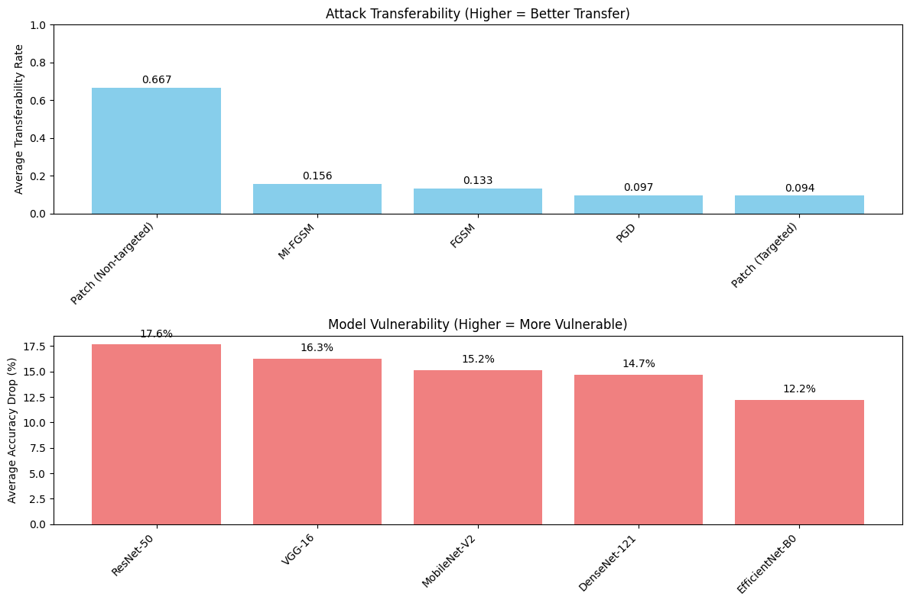
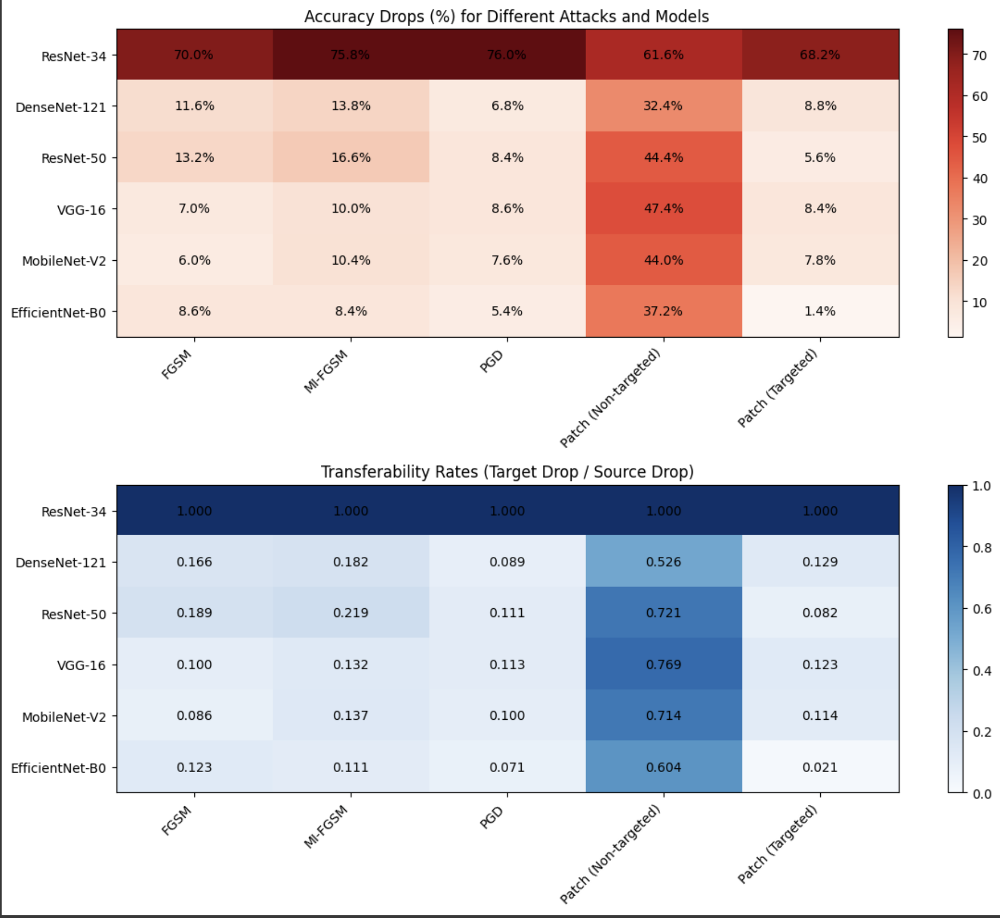

# Jailbreaking Deep Models

**Team Name: Neural Vibes**

**Authors:**
- Nishanth Kotla (nk3968@nyu.edu)
- Shreyas Bhaktharam (sb9855@nyu.edu)
- Ranjan Patil (sp8171@nyu.edu)

*New York University*

---

This project systematically evaluates the vulnerability of deep convolutional neural networks (CNNs) to various adversarial attacks. We focus on ResNet-34 as the source model and test transferability on other architectures, exploring pixel-wise and patch-based attacks, and enhancing transferability techniques.

## Table of Contents

1. [Project Overview](#project-overview)
2. [Environment Setup](#environment-setup)
3. [Dataset Preparation](#dataset-preparation)
4. [Baseline Evaluation](#baseline-evaluation)
5. [Adversarial Attack Implementations](#adversarial-attack-implementations)
   * [FGSM Attack](#fgsm-attack)
   * [MI-FGSM Attack](#mi-fgsm-attack)
   * [PGD Attack](#pgd-attack)
   * [Patch Attacks](#patch-attacks)
6. [Transferability Analysis](#transferability-analysis)
7. [Enhancing Transferability](#enhancing-transferability)
8. [Results Summary](#results-summary)
9. [Usage and Scripts](#usage-and-scripts)
10. [Conclusions and Future Work](#conclusions-and-future-work)

## Project Overview

Jailbreaking Deep Models aims to:

* Establish baseline performance of a pretrained ResNet-34 on a subset of ImageNet-1K.
* Implement and compare adversarial attacks: FGSM, MI-FGSM, PGD, and localized patch attacks.
* Analyze cross-model transferability on diverse architectures (ResNet-50, DenseNet-121, VGG-16, MobileNet-V2, EfficientNet-B0).
* Propose and evaluate methods to enhance attack transferability.

## Environment Setup

**Requirements:**

* Python 3.8+
* PyTorch ≥1.12
* torchvision ≥0.13
* numpy, matplotlib, tqdm, nltk, requests

**Installation (conda):**

```bash
conda create -n advrobust python=3.8 pytorch torchvision cudatoolkit=11.3 -c pytorch
pip install numpy matplotlib tqdm nltk requests
```

Download WordNet data:

```python
import nltk
nltk.download('wordnet')
```

## Dataset Preparation

1. Download the large files from this [Google Drive folder](https://drive.google.com/drive/folders/1LpAk504AjopwytBFl87a1Qfrpx1yLnka?usp=sharing)
2. Extract `large_files.zip` into the root directory of the project
3. Unzip the provided `TestDataSet.zip` into `./TestDataSet`
4. Use standard ImageNet normalization (mean=[0.485,0.456,0.406], std=[0.229,0.224,0.225])
5. Map local folder names (WordNet IDs) to ImageNet class indices via `imagenet_class_index.json`

## Baseline Evaluation

* **Model:** ResNet-34 (ImageNet-1K pretrained)
* **Data:** 500 images from 100 classes

| Metric         | Value  |
|---------------|--------|
| Top-1 Accuracy | 76.00% |
| Top-5 Accuracy | 94.20% |

These serve as reference points for adversarial performance.

## Adversarial Attack Implementations

### FGSM Attack

* **Method:** Fast Gradient Sign Method (ε=0.02)
* **Results:**
  * Top-1 ↓ from 76.00% to 6.00% (70.00% drop)
  * Top-5 ↓ from 94.20% to 35.40% (58.80% drop)
* **Attack Success Rate:** 70.00%

### MI-FGSM Attack

* **Method:** Momentum Iterative FGSM (ε=0.02, α=0.005, iter=10)
* **Results:**
  * Top-1 ↓ to 0.20% (75.80% drop)
  * Top-5 ↓ to 10.40% (83.80% drop)
* **Success Rate:** 75.80%

### PGD Attack

* **Method:** Projected Gradient Descent (ε=0.02, α=0.005, iter=20, targeted least-likely)
* **Results:**
  * Top-1 ↓ to 0.00% (76.00% drop)
  * Top-5 ↓ to 0.80% (93.40% drop)
* **Success Rate:** 76.00%

### Patch Attacks

**Non-Targeted (ε=0.5, 32×32 patch)**
* Top-1 ↓ to 14.40% (61.60% drop)
* Top-5 ↓ to 36.20% (58.00% drop)
* Success Rate: 62.20%

**Targeted (ε=1.0, 32×32 center patch)**
* Top-1 ↓ to 7.80% (68.20% drop)
* Top-5 ↓ to 8.20% (86.00% drop)
* Success Rate: 68.40% / 86.20% (Top-1/Top-5)

## Transferability Analysis

Test adversarial sets (crafted on ResNet-34) against:
* ResNet-50, DenseNet-121, VGG-16, MobileNet-V2, EfficientNet-B0

**Average Top-1 Drop on other models:**

| Attack | Avg Transfer Rate |
|--------|------------------|
| Non-targeted Patch | 0.667 |
| MI-FGSM | 0.156 |
| FGSM | 0.133 |
| PGD | 0.097 |
| Targeted Patch | 0.094 |

**Model Robustness Ranking (avg drop):**
1. ResNet-50 (17.64%)
2. VGG-16 (16.28%)
3. MobileNet-V2 (15.16%)
4. DenseNet-121 (14.68%)
5. EfficientNet-B0 (12.20%)

## Enhancing Transferability

We introduced:
* **Input Diversity:** Random resizing & padding
* **Translation Invariance:** Gaussian blur on gradients
* **Variance Tuning:** Add controlled noise to gradients
* **Momentum:** Accumulate normalized gradients

**Transferability Improvements for FGSM:**
* Before: 0.133 → After: 0.514
* PGD: 0.097 → 0.108
* Targeted Patch: 0.094 → 0.110

## Results Summary

* **Baseline:** 76% Top-1, 94.2% Top-5
* **FGSM:** 6% Top-1, 35.4% Top-5
* **MI-FGSM:** 0.2% Top-1, 10.4% Top-5
* **PGD:** 0.0% Top-1, 0.8% Top-5
* **Patch (NT):** 14.4% Top-1, 36.2% Top-5
* **Patch (T):** 7.8% Top-1, 8.2% Top-5
* **Enhanced Transfer FGSM:** Transfer rate 0.514

## Results Visualized




## Usage and Scripts

All implementations, including baseline evaluation, attacks, and analysis, are contained in a single Jupyter notebook:

* **Main Notebook:** `DL_P3_FINAL.ipynb`
  - Baseline model evaluation
  - FGSM and MI-FGSM implementations
  - PGD attack implementation
  - Patch attack implementations
  - Transferability analysis
  - Results visualization and analysis

**Saving/Loading Adversarial Sets:**
```python
torch.save({ 'adv_images': images, 'labels': labels }, 'Adversarial_Set_X.pt')
# Load:
data = torch.load('Adversarial_Set_X.pt')
```

## Conclusions and Future Work

* Iterative attacks (MI-FGSM, PGD) break models completely under L∞ constraints.
* Localized patch attacks can achieve up to 86% Top-5 drop with strategic optimization.
* Transferability does not correlate directly with attack strength; simple patch attacks transfer best.
* Enhanced FGSM with diversity & variance tuning becomes highly transferable.

**Future Directions:**
* Study transferability under different norms (L0, L2).
* Develop certified defenses against patch attacks.
* Explore black-box optimization and universal perturbations.
* Real-world robustness evaluation on deployed systems.
